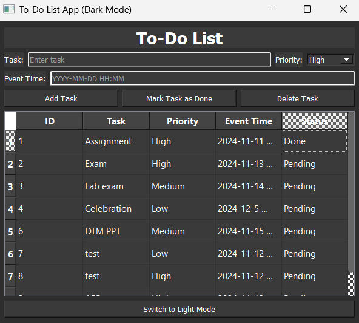

# 📝 To-Do List with Google Tasks Integration

A desktop-based To-Do List application built using **PyQt5** that helps you manage tasks locally and sync them with **Google Tasks**. It features priority tagging, event time scheduling, dark mode, and seamless integration with the Google Tasks API.

## 🚀 Features

- Add, delete, and mark tasks as done ✅
- Assign **priority levels** (High, Medium, Low) with colored indicators 🔴🟡🟢
- Schedule tasks using a date-time input 📅
- Enable **Dark Mode** for a comfortable viewing experience 🌙
- Sync tasks with **Google Tasks** using OAuth2 📤
- Local task storage using **SQLite** for offline access 💾

## 📸 Screenshots

### Light Mode


### Dark Mode


## 🛠️ Installation

### Prerequisites
- Python 3.7+
- A Google Cloud project with Google Tasks API enabled
- Your own `credentials.json` file for OAuth2

### Clone the repo
```bash
git clone https://github.com/<your-username>/todolist-google-tasks.git
cd todolist-google-tasks
```

## 🛠️ Installation

### Install dependencies
```bash
pip install -r requirements.txt
```

### Run the App
```bash 
python main.py
```
On first run, a browser will open for Google sign-in. Once authorized, a token.json file will be saved for future runs.

### 🧰 Tech Stack
- Python 3
- PyQt5
- SQLite3
- Google Tasks API
- Google Auth Libraries (google-auth, google-auth-oauthlib, google-api-python-client)

### 🔐 Google API Setup
1. Go to Google Cloud Console
2. Create a new project or use an existing one
3. Enable the Google Tasks API
4. Go to Credentials > Create credentials > OAuth 2.0 Client ID
5. Download the credentials.json and place it in the root directory of this project

### 🙌 Acknowledgements
[Google API Python Client](https://github.com/googleapis/google-api-python-client)

[PyQt5 Documentation](https://doc.qt.io/qtforpython-6/)
